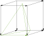

# Bonak 

Bonak is a research project that formalizes semi-cubical and augmented semi-simplicial sets in Coq as a particular case of iterated parametricity translation. Prior to the start of the project, Hugo had worked out the rough type-theory of semi-cubical types on pen-and-paper, and hypothesized that it could be formalized in Coq. The project started when Hugo and Ram met to test the hypothesis. They then met once a week for the next 2.5 years, to commit time to work on the project. The first commit was made on August 15, 2019, and the formalization was completed on 22 February 2022. Indeed, it has been quite an adventure.

The name _bonak_ comes from an imaginary monster in Daisy Johnson's novel [Everything Under](https://thebookerprizes.com/the-booker-library/books/everything-under), which was shortlisted for the Man Booker Prize in 2018. It happens to be an exciting read, and Ram had read the book at around the time this project started.

Some features of this project:

1. We do not make use of [HoTT](https://github.com/HoTT/HoTT), or any fancy libraries for that matter. Bonak is written is vanilla Coq, making use of the core standard libarary. In particular, we make heavy use of [SProp](https://coq.inria.fr/refman/addendum/sprop.html) for proof irrelevance.
2. Bonak has led to many bugs being filed and fixed in core Coq. It pushes the boundaries of proof assistant technology, and can serve as a benchmark against which to improve core Coq features.
3. As the main contribution of Bonak is the Coq code, we have placed high emphasis on code cleanliness and readability. As a result, it's quite plesant to step through the code, and have a succinct goal at all times.
4. Bonak is tiny! In ~800 lines of Coq code, we have managed to prove something remarkable. We did have a lot of false starts, and tried various approaches, before settling on what we have today.

Our axioms are:

```text
Section Variables:
side : HSet
Axioms:
STrue relies on definitional UIP. (* bug: coq/coq#16427 *)
functional_extensionality_dep
  : forall (A : Type) (B : A -> Type) (f g : forall x : A, B x),
	(forall x : A, f x = g x) -> f = g
fext_computes
  : forall (A : Type) (B : A -> HSet) (f : forall a : A, B a),
    functional_extensionality_dep f f (fun a : A => eq_refl) = eq_refl
```

## Current status

Our approach is generic over the arity of the parametricity translation: we use functional extensionality for this, but it can, in principle, be done without this axiom for any fixed finite arity. `master` is a complete version of our formalization, without any incomplete proofs.
